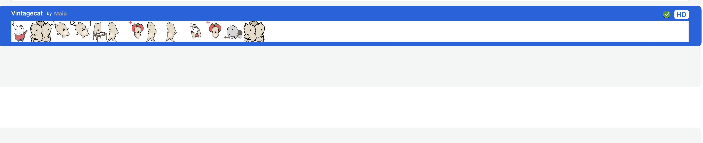
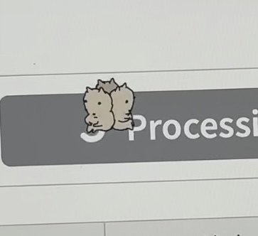
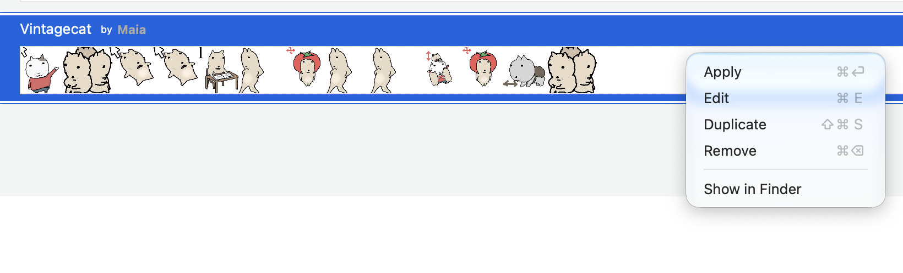

# VintageCatMouse
VintageCat — 复古猫的 macOS 鼠标光标主题，适用于 Mousecape。 / A vintagecat-themed cursor theme for macOS, made with Mousecape.
# VintageCat

> 复古猫咪风格的 macOS 鼠标光标主题，适用于 Mousecape。  
> A vintage cat-themed cursor theme for macOS, made with Mousecape.





## 简介

VintageCat 是一套为 macOS 制作的鼠标光标主题，使用 [Mousecape](https://github.com/alexzielenski/Mousecape) 创建和导出。  

## 特性

- 复古猫风格光标
- 适用于 macOS + Mousecape （Windows可以自行下载mousecape使用）
- 以 `.cape` 文件分发，导入方便
- 可随时在 Mousecape 中切换或恢复默认光标

## 安装与使用

### 1. 安装 Mousecape

首先需要安装 Mousecape：

- 官方仓库：<https://github.com/alexzielenski/Mousecape>
- 下载 Releases：<https://github.com/alexzielenski/Mousecape/releases>

请根据 Mousecape 的说明完成安装，并确保它能在你的 macOS 版本上正常运行。

### 2. 下载 VintageCat

你可以通过以下方式获取主题文件：

- 直接下载本仓库中的 `VintageCat.cape`
- 或前往本仓库的 **Releases** 页面下载最新版本

### 3. 导入主题

下载 `VintageCat.cape` 后：

1. 双击 `VintageCat.cape` 文件；
2. 如果系统询问打开方式，选择 **Mousecape**；
3. 或者先打开 Mousecape，然后把 `VintageCat.cape` 拖入 Mousecape 窗口。

### 4. 应用主题

1. 打开 Mousecape；
2. 在主题列表中找到 **VintageCat**；
3. 右键点击 **VintageCat**；
4. 选择 **Apply**；
5. 如果光标没有立即变化，尝试注销并重新登录，或重启 Mac。


### 5. 恢复默认光标

如果你想恢复系统默认光标：

1. 打开 Mousecape；
2. 选择系统默认主题，或你之前使用的主题；
3. 右键选择 **Apply**；
4. 如未生效，注销或重启。

## 系统要求

- macOS
- 能正常运行的 Mousecape
- 建议在安装前确认 Mousecape 与你的 macOS 版本兼容

## 文件结构

```text
.
├── VintageCat.cape
├── preview.png
├── README.md
└── LICENSE
```

## 常见问题

### 双击 `.cape` 文件没有反应？

先打开 Mousecape，再把 `VintageCat.cape` 拖进 Mousecape 窗口。  
也可以右键 `.cape` 文件，选择“打开方式” -> Mousecape。

### 应用后光标没有变化？

尝试以下方法：

- 移动鼠标到不同区域，例如桌面、文本输入框、窗口边缘；
- 注销并重新登录；
- 重启 Mac；
- 确认 Mousecape 已获得必要权限。

### 如何删除或卸载 VintageCat？

在 Mousecape 中删除对应主题，然后应用回默认主题即可。


## 制作说明

VintageCat 使用 Mousecape 制作并导出为 `.cape` 文件。  
如果你想制作自己的光标主题，可以访问 Mousecape 项目了解更多。

## 致谢

- [Mousecape](https://github.com/alexzielenski/Mousecape) — macOS 光标主题制作与切换工具
- 感谢所有喜欢和分享 VintageCat 的人

## 作者

- GitHub：[@Viereinsmai](https://github.com/Viereinsmai)

## License

[CC BY 4.0](https://creativecommons.org/licenses/by/4.0/) 许可。

你可以自由分享和改编，但请保留署名。  
Mousecape 本身遵循其原仓库的许可证。
